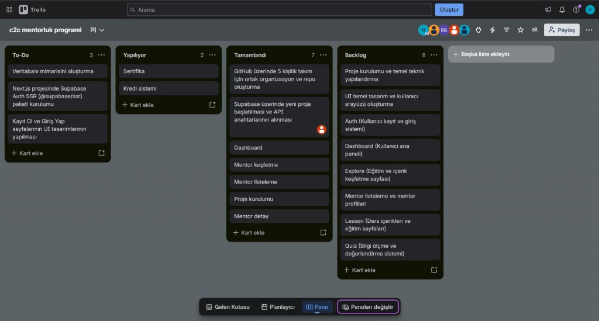
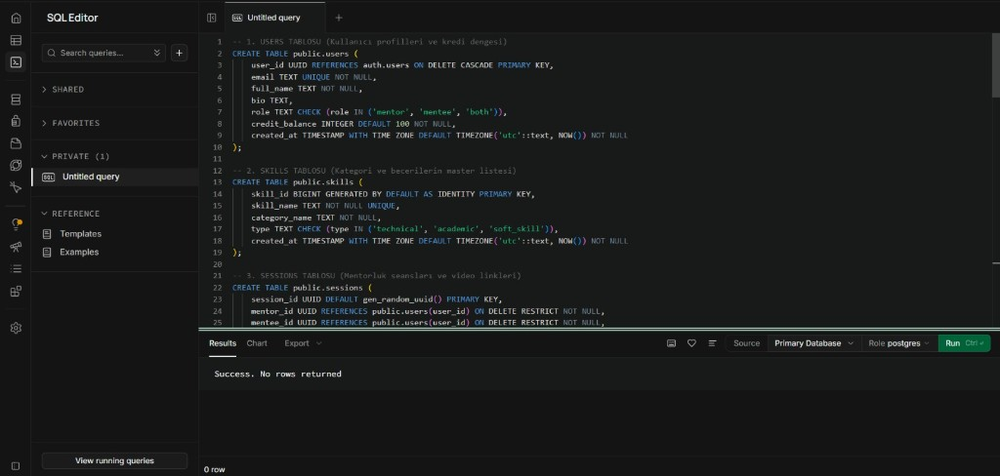
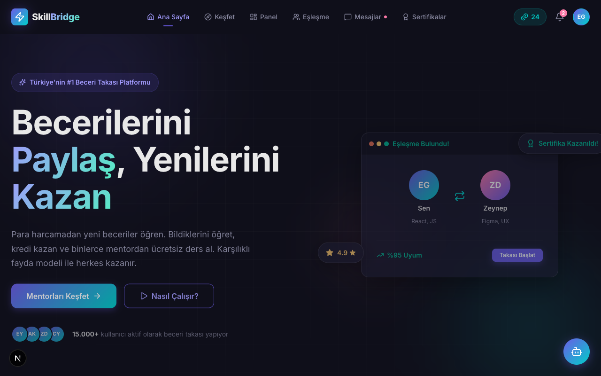
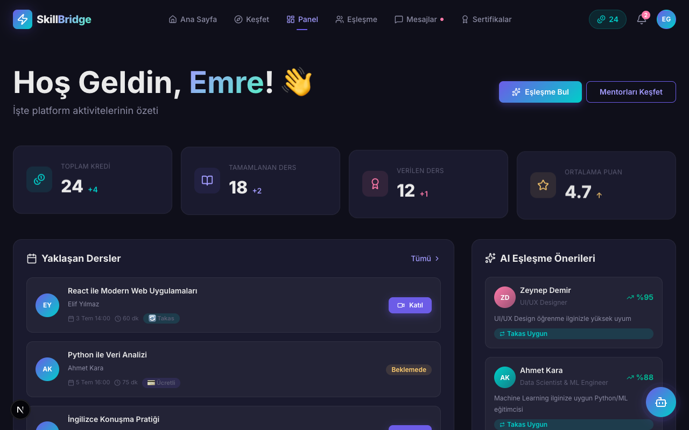
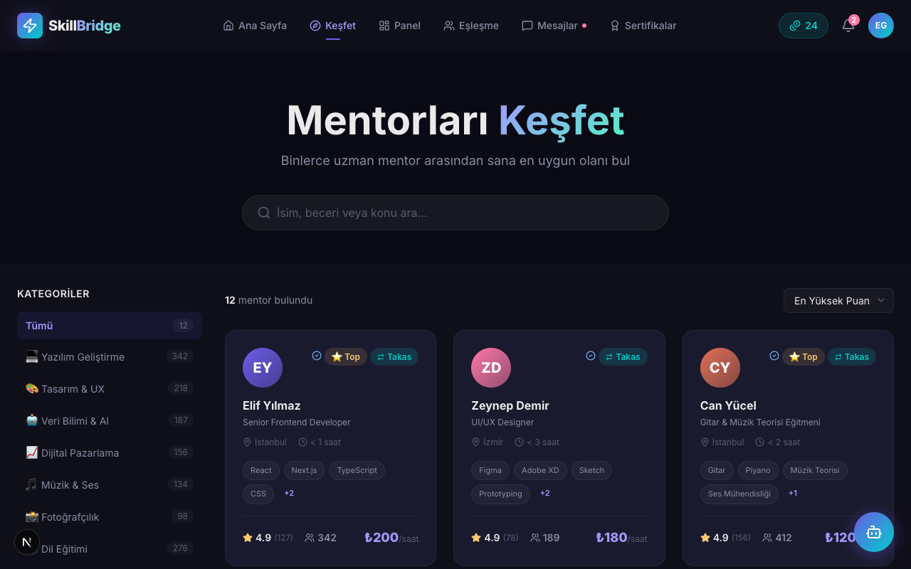
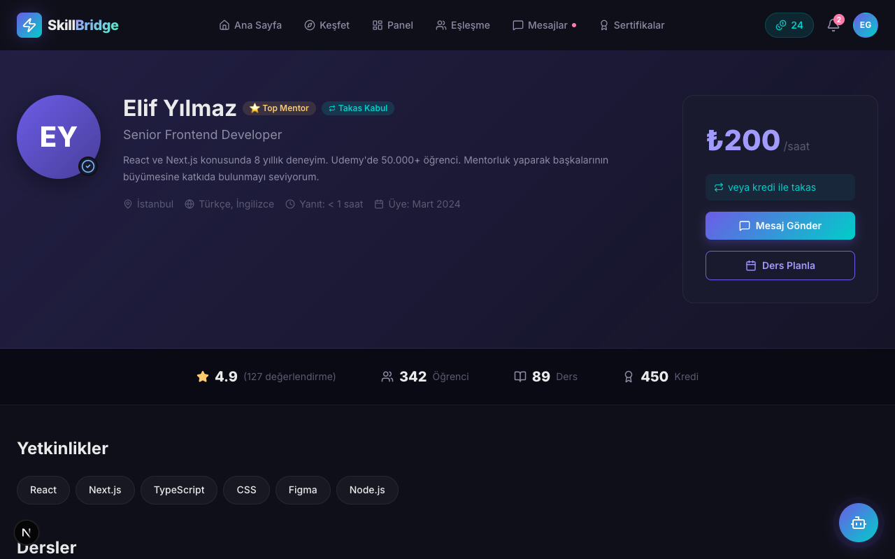

# **Grup 11**

# Ürün İle İlgili Bilgiler

## Takım Elemanları

- Hüseyin Emre Gümüş: Product Owner
- Helin Ersuy: Scrum Master
- Özde Hava Sinecek: Team Member/Developer
- Hümeyra Korkmaz: Team Member/Developer
- Özge Şahin: Team Member/Developer
- Elif Buse Çetinel: Team Member/Developer

## Ürün İsmi

--C2C Mentorluk ve Beceri Takası Platformu (Eğitim, Mentorluk ve Eşleşme)--

## Ürün Açıklaması

- Çoklu disiplinlerde ders ve eşleşme imkanı sunan, geniş bir hedef kitleye yönelik tasarlanmış uçtan uca bir **C2C Mentorluk ve Beceri Takası** ekosistemidir. Platform, eğitim veren ve alan tarafları bir araya getirerek sürdürülebilir bir beceri takası ağı kurmayı ve gelişmiş bir kategorizasyon altyapısı ile bilgiye erişimi optimize etmeyi amaçlar.

## Ürün Özellikleri

- **🔄 Sürdürülebilir Takas Modeli (Temel Rekabet Avantajı):** Kullanıcıların finansal harcama yapmadan hizmet alabilmesine olanak tanıyan, "verilen eğitim oranında eğitim alma hakkı kazanılması" prensibine dayalı karşılıklı fayda modeli.
- **🪙 Kredi ve Puan Mekanizması:** Ortalama 15 dakikalık hızlı mentorluk (mikro beceri takası) oturumları. Platforma sağlanan fayda ölçüsünde kredi kazanılmasını ve bu kredilerin yeni hizmet alımlarında kullanılmasını sağlayan puanlama sistemi.
- **💳 Güvenli Ödeme Altyapısı:** Ücretli eğitimlerde finansal güvenliği sağlamak amacıyla ödemelerin ortak bir havuzda bloke edilmesi ve hizmetin tamamlanıp tarafların karşılıklı onay vermesinin ardından transfer edilmesi.
- **🤝 Akıllı Eşleştirme ve İletişim:** Yetkinlikler doğrultusunda algoritmik eşleştirme altyapısı ve platform içi anlık mesajlaşma (in-app chat) sistemi.
- **📹 Video Konferans Entegrasyonları:** Canlı ders ve mentorluk seanslarının yürütülmesi için dış kaynaklı video konferans (örn. Google Meet) entegrasyonu.
- **📜 Sertifikasyon ve Oyunlaştırma:** Süreç sonlarında yetkinliği belgelemek amacıyla sertifika ve rozet atama sistemi.
- **🤖 AI Tabanlı Asistan (Chatbot):** Platform içi kullanıcı navigasyonunu kolaylaştıran ve anlık destek sunan yapay zeka destekli sohbet robotu.
- **📝 Dinamik AI Değerlendirme Modülü (Chat Quiz):** Eğitim süreçlerinin ardından sertifikasyonu otomatize etmek üzere yapay zeka tarafından yönetilen sohbet tabanlı sınav sistemi. Bu modülden elde edilen veriler, eğitim verenin kalite skorunu (rating) doğrudan etkileyecektir.

## Hedef Kitle

- Akran öğrenimi ve beceri takası yapmak isteyen her yaş grubundan öğrenici ve mentorlar
- Finansal bariyerler olmadan yeni bir beceri edinmek isteyen bireyler
- Yetkinliklerini belgelemek ve sertifika almak isteyen kullanıcılar
- Yapay zeka destekli pratik yapmak isteyen teknoloji meraklıları

## Product Backlog URL

[Trello Backlog Board](https://trello.com/b/61xmZye8)

---

# Sprint 1

- **Backlog düzeni ve Story seçimleri**: Projenin ilk hedeflerine ve MVP (Minimum Viable Product) gereksinimlerine göre backlog düzenlenmiştir. Trello board üzerinde işler (User Story & Task) önem sırasına göre listelenmiş ve puanlandırılmıştır.
- **Daily Scrum**: Sprint 1 boyunca gerçekleştirilen toplantı notları ve alınan kararlar detaylı olarak [Sprint 1 Günlük Scrum Toplantı Notları](ProjectManagement/Sprint1Documents/DailyScrumMeetingNotesSprint1.md) dosyasında belgelenmiştir. Toplantıların kısa özeti aşağıdadır:
  - **23 Haziran | Proje Başlangıç (Kick-off) ve Fikir Geliştirme Toplantısı (75 Dakika)**
    - *Gündem:* Bootcamp gereksinimlerinin analizi, odaklanılacak sektörün belirlenmesi.
    - *Özet & Kararlar:* Eğitim sektörüne odaklanılmasına karar verildi. Bir sonraki toplantıya kadar eğitim sektörü özelinde proje vizyonunun netleştirilmesi kararlaştırıldı.
  - **25 Haziran | Ürün Vizyonu ve İş Modeli Yapılandırma Toplantısı (30 Dakika)**
    - *Gündem:* Proje konseptinin tanımlanması, MVP gereksinimlerinin ve iş/gelir modellerinin tasarlanması.
    - *Özet & Kararlar:* C2C Mentorluk ve Beceri Takası ekosistemi, sürdürülebilir takas modeli, kredi ve puanlama mekanizması, güvenli ödeme altyapısı, akıllı eşleştirme ve video konferans entegrasyonu, oyunlaştırma ile yapay zeka entegrasyonları (Chatbot ve Chat Quiz) kararlaştırıldı.
  - **30 Haziran | Kaynak Planlaması ve Yol Haritası (Roadmap) Toplantısı (30 Dakika)**
    - *Gündem:* Ekip kapasitesinin değerlendirilmesi, görev dağılımının yapılması ve genel gelişim planının oluşturulması.
    - *Özet & Kararlar:* Ekip içi görev dağılımı gerçekleştirildi ve projenin genel ilerleme planı oluşturulmaya başlandı.
- **Sprint board update**: Sprint 1 süresince güncellenen Trello panosuna [Trello Backlog Board](https://trello.com/b/61xmZye8) adresi üzerinden ulaşılabilir.
  
  
- **Ürün Durumu**: Projenin geliştirilmekte olan mevcut Next.js arayüzünün ekran görüntüleri alt kısımda paylaşılmıştır.
- **Sprint Review**: İlk prototip aşaması ve teknik fizibilite çalışmaları değerlendirilmiştir. Yapay zeka ve video konferans entegrasyonları için gerekli teknik altyapı araştırması tamamlanmıştır. Ayrıca Sprint 1 kapsamında tasarlanan temel veritabanı tabloları [Veritabanı Şeması (SQL)](ProjectManagement/Sprint1Documents/database_schema.sql) dosyasına eklenmiştir.

  
- **Sprint Retrospective**: Ekip içindeki görev dağılımının verimliliği artırdığı gözlemlenmiştir. İlerleyen süreçlerde sprint planlama toplantılarına katılımın ve zaman yönetiminin sürdürülmesi kararlaştırılmıştır.

---

# Sprint 2

* **Backlog düzeni ve Story seçimleri**: Projenin ikinci faz hedeflerine, canlı ortam (production) geçişine ve AI entegrasyon MVP gereksinimlerine göre backlog yeniden düzenlenmiştir. Trello board üzerinde işler (User Story & Task) yapay zeka eşleşme algoritmaları, gerçek zamanlı iletişim ve canlı test süreçlerine göre önceliklendirilmiş ve puanlandırılmıştır.

* **Daily Scrum**: Sprint 2 boyunca gerçekleştirilen toplantı notları ve alınan kararlar detaylı olarak [Sprint 2 Günlük Scrum Toplantı Notları](ProjectManagement/Sprint2Documents/DailyScrumMeetingNotesSprint2.md) dosyasında belgelenmiştir. Toplantıların kısa özeti aşağıdadır:
    * **7 Temmuz | Sprint 1 Değerlendirmesi ve Ortak Veritabanı Yapılandırma Toplantısı (50 Dakika)**
        * *Gündem:* Geçmiş sprint çıktılarının gözden geçirilmesi, Supabase üzerinde ortak çalışma alanlarının kurulması ve ekip içi erişim yetkilerinin senkronizasyonu.
        * *Özet & Kararlar:* Sprint 1 hedeflerinin başarıyla tamamlandığı teyit edildi. Supabase üzerinde tüm ekibin ortak çalışabileceği organizasyon hesabı aktif edildi ve API anahtarları frontend ekibine güvenli şekilde aktarıldı. `users`, `skills`, `sessions` ve `transactions` tablolarından oluşan veri tabanı mimarisi doğrulandı. Yeni kayıt olan kullanıcılara otomatik 100 hoş geldin kredisi tanımlayan PostgreSQL tetikleyicisi (Trigger) ile satır bazlı güvenlik duvarı (RLS) başarıyla test edildi. Master `skills` tablosuna 12 temel kategoride test verisi basılarak frontend ekibinin arama/filtreleme testleri yapması sağlandı. Ayrıca projenin kurumsal kimlik ve isim değişikliği süreci resmen başlatıldı.
    * **14 Temmuz | Canlı Ortam (Production) Testleri ve Yapay Zeka Entegrasyon Toplantısı (60 Dakika)**
        * *Gündem:* Projenin canlıya (Production) taşınması, hazır hale gelen örnek kullanıcı panelinin (Dashboard) deneyimlenmesi ve temel düzey AI Chat modülünün aktifleştirilmesi.
        * *Özet & Kararlar:* Platform başarıyla canlı test ortamına (Vercel & Supabase Production) taşındı ve tüm ekibin internet üzerinden erişimine açıldı. Hazırlanan örnek kullanıcı paneli (Dashboard) uçtan uca test edilerek UI/UX revizyon listesi çıkarıldı. Vercel AI SDK ve OpenAI (`gpt-4o-mini`) entegrasyonu tamamlanarak platformun en kritik özelliklerinden biri olan temel düzey yapay zeka destekli sohbet (AI Chatbot) mekanizması başarıyla aktif edildi. Bir sonraki aşamada `pgvector` tabanlı akıllı mentor eşleşmelerine ve `Supabase Realtime` mesajlaşma odalarına odaklanılması kararlaştırıldı.

* **Sprint board update**: Sprint 2 süresince güncellenen Trello panosuna [Trello Backlog Board](https://trello.com/b/61xmZye8) adresi üzerinden ulaşılabilir.

## 📸 Ekran Görüntüleri

| Ana Sayfa | Kullanıcı Paneli (Dashboard) |
| :---: | :---: |
|  |  |

| Keşfet (Explore) | Mentor (Mentor) |
| :---: | :---: |
|  |  |

---

## 🛠️ Kullanılan Teknolojiler

- **[Next.js 16](https://nextjs.org/):** React tabanlı güçlü ve performanslı modern web framework'ü (App Router yapısı).
- **[React 19](https://react.dev/):** Yeni nesil bileşen (component) mimarisi.
- **[Framer Motion](https://www.framer.com/motion/):** Akıcı, etkileşimli ve modern arayüz animasyonları.
- **[Lucide React](https://lucide.dev/):** Hafif ve ölçeklenebilir modern ikon kütüphanesi.
- **CSS Modules & Vanilla CSS:** Bileşen bazlı (component-scoped) stil mimarisi.

---

## 📂 Proje Yapısı

| Klasör / Dosya | Açıklama |
| :--- | :--- |
| **`src/app/`** | Next.js App Router (Ana sayfalar ve Layout) |
| ├── `auth/` | Giriş ve Kayıt (Login/Register) |
| ├── `certificates/` | Sertifika görüntüleme ve yönetimi |
| ├── `chat/` | Sohbet ve mesajlaşma arayüzü |
| ├── `dashboard/` | Kullanıcı paneli |
| ├── `explore/` | Yeni eğitimler ve mentorlar keşfetme |
| ├── `lesson/` | Ders içerikleri ve videoları |
| ├── `match/` | Eşleşme sistemi ekranları |
| ├── `mentor/` | Mentor profilleri ve listesi |
| ├── `payment/` | Ödeme adımları |
| ├── `quiz/` | Testler ve sınavlar |
| └── `settings/` | Kullanıcı hesap ayarları |
| **`src/components/`** | Tekrar kullanılabilir (reusable) UI bileşenleri |
| **`src/data/`** | Mock veriler, sabit değişkenler vb. |

---

## 🚀 Kurulum & Çalıştırma

Projeyi yerel ortamınızda (local) çalıştırmak için aşağıdaki adımları izleyin:

1. **Projeyi Klonlayın:**
   ```bash
   git clone https://github.com/emregms/bootcamp_grup_11.git
   cd bootcamp_grup_11
   ```

2. **Bağımlılıkları Yükleyin:**
   ```bash
   npm install
   ```

3. **Geliştirme Sunucusunu Başlatın:**
   ```bash
   npm run dev
   ```

4. **Tarayıcıda Görüntüleyin:**
   [http://localhost:3000](http://localhost:3000) adresine giderek platformu deneyimleyebilirsiniz.
